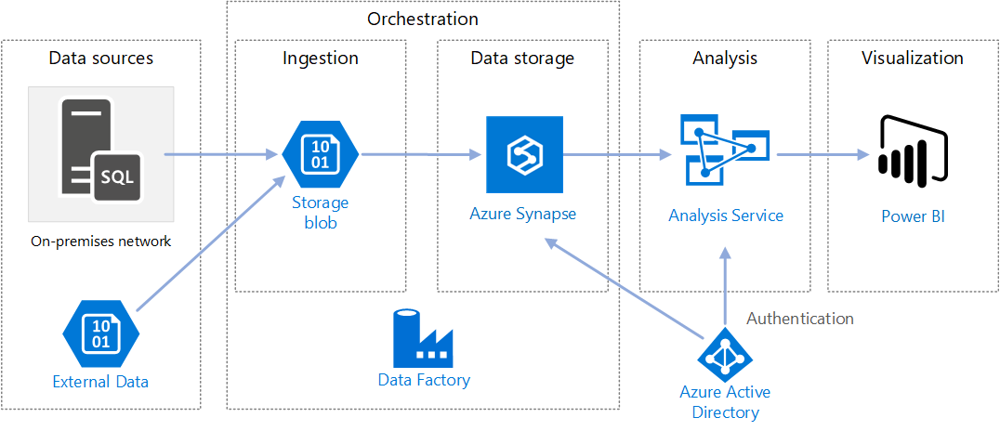

# "Mini" Data Lake with AWS EMR Hadoop, Spark/PySpark and S3. Weather impact on NY Yellow and Green Cabs, Uber, and Car Crashs - an udacity Capstone Project 
#### - [Scope](#scope)
#### - [Data Sources](#data-sources)
#####        - [Uber](#uber)
#####        - [Yellow and Green NY Cabs](#yellow-and-green-ny-cabs)
#####        - [Crash Data](#crash-data)
#####        - [Weather Data](#weather-data)
#### - [Data Sources Repositories](#data-sources-repositories)
#### - [Tools, Technologies, and Data Model](#tools\,-technologies\,-and-data-model)
#####        - [Data Model](#data-model)
#####        - [Tools Technologies used:](#tools-technologies-used)
#####        - [Hardware](#hardware)
#### - [Alternative Scenarios](#alternative-scenarios)
#####        - [The data was increased by 100x.](#the-data-was-increased-by-100x.)
#####        - [The pipelines would be run on a daily basis by 7 am every day.](#the-pipelines-would-be-run-on-a-daily-basis-by-7-am-every-day.)
#####        - [The database needed to be accessed by 100+ people.](#the-database-needed-to-be-accessed-by-100+-people.)
#### - [Project Running Steps](#project-running-steps)
#####        - [Data Extraction](#data-extraction)
#####        - [Data Load](#data-load)
#####        - [Data Transformation](#data-transformation)
#####        - [Data Quality and Data Cleansing](#data-quality-and-data-cleansing)
#### - [How to run](#how-to-run)
#### - [Data Dictionary](#data-dictionary)
#### - [Recommendations for how to use the data to come up with insights](#recommendations-for-how-to-use-the-data-to-come-up-with-insights)

## Scope

This project aims to create (some sort of) a "mini" Data Lake  to provide all the necessary data to analyze the weather impact on:
- Uber, Yellow and Green Taxis pickups from **March 2014 to Sep 2014 and Jan 2015 to Jun 2015** (more on why those dates below on "data sources")  on New York city.
- Car crashes from **2013 to 2019** on New York City,

## Data Sources
### Uber ###
Uber Pickups data from [data.world](https://data.world/data-society/uber-pickups-in-nyc). Quoting them: 
"This data contains on over 4.5 million Uber pickups in New York City **from April to September 2014**, and 14.3 million more Uber pickups from January to June 2015. Trip-level data on 10 other for-hire vehicle (FHV) companies, as well as aggregated data for 329 FHV companies, is also included. All the files are as they were received on August 3, Sept. 15 and Sept. 22, 2015."

### Yellow and Green NY Cabs 
(Yes, there are Green...)
Data hosted by the AWS  ["Open Data"](https://aws.amazon.com/pt/opendata/?wwps-cards.sort-by=item.additionalFields.sortDate&wwps-cards.sort-order=desc) initiative [here](https://registry.opendata.aws/nyc-tlc-trip-records-pds/),
Data of trips taken by taxis in New York City, supplied by The Official Website of the City of New York. Use Data License [here](https://www1.nyc.gov/home/terms-of-use.page).
*Since the date range of uber is limited from April to September 2014 and from January to June 2015, data from Yellow and Green cab was limited to this same period as well.*

### Crash Data
Data from [NYC Open Data](https://data.cityofnewyork.us/Public-Safety/Motor-Vehicle-Collisions-Crashes/h9gi-nx95).
"The Motor Vehicle Collisions crash table contains details on the crash event. Each row represents a crash event. The Motor Vehicle Collisions data tables contain information from all police reported motor vehicle collisions in NYC. The police report (MV104-AN) is required to be filled out for collisions where someone is injured or killed, or where there is at least $1000 worth of damage"
**Date range from 2013 to 2019.**

### Weather Data
This data was retrieved from [Weather Underground](https://www.wunderground.com/).
Weather Underground is a commercial weather service providing real-time weather information over the Internet. Weather Underground provides weather reports for most major cities across the world on its Web site, as well as local weather reports for newspapers and third-party sites.

For the NY City they have several weather stations collecting data all over town. But they have historical data only on two stations - the **"John F. Kennedy International Airport" (JFK)** and **"LaGuardia Airport" (LGA)**. Therefore this project uses data from  those two stations from **2013** to **2019** (same date range from "Crash Data")

## Data Sources Repositories

| Data | Repository | Data Format | Inicial Volume| Initial Rows
|--|--|--|--|--|
|Uber  |2014 - https://download.data.world/file_download/data-society/uber-pickups-in-nyc/uber-raw-data-[apr-set]14.csv; 2015 - https://download.data.world/file_download/data-society/uber-pickups-in-nyc/uber-raw-data-[jan-june]-15.csv%2Fuber-raw-data-[jan-jun]-15.csv  | CSV | ~1Gb | 18,804,806|
|Yellow/Green NY Cabs| s3://nyc-tlc/trip data/[yellow/Green]_tripdata_[2014-2015]-[01-09].csv | CSV |~30Gb  | 177,426,428|~30Gb
|Crash  |https://data.cityofnewyork.us/resource/h9gi-nx95.json (API Endpoint)|JSON|700Mb| ~7,000|
|Weather|https://cgsuthm-my.sharepoint.com/:x:/g/personal/rafa_rodriguess_edrive_icu/EY8ivhZmW81Otf2Mv9Tjmz0Bwm7oNoF6Ev5-qQtIM6bVFA?e=ap2e5c&download=1|CSV |16mb|140,997

## Tools, Technologies, and Data Model

### Data Model
The chosen data mode is the one below, borrowed from Microsoft: 

This project comprehends the "Orchestration" frame (Ingestion+Data Storage), using External Data as data sources (listed on the **"Data Sources Repositories"** section).

**ELT** process was used. In the Ingestion Area (AKA **"Storage Blob"** from now on) everything was copied "AS IS". There was no requirement to transform the data into a special format before saving it in the Storage Blob.

### Tools Technologies used:

As storage (both "Storage Blob" and "Data Storage") **S3** was the chosen technology. For the ecosystem, was used **Hadoop with Spark/PySpark pair.**

**S3**  is cheap, reliable, and easy to configure and use.

**Hadoop** uses a storage system wherein the data is stored on a distributed file system. Since the tools used for the processing of data are located on same servers as the data, the processing operation is also carried out at a faster rate. 

**PySpark** is just a Python wrapper around Apache Spark which is written in Scala programming language, capable handling the distributed processing.

The final dataframework was stored as **parquet** file format, *partitioned by Year and Month*.

	ERM - 5.30.0
	Hadoop - Amazon 2.8.5
	Spark - 2.4.5
	Python - 3.7	

### Hardware
It was used [AWS EMR](https://aws.amazon.com/pt/emr/?whats-new-cards.sort-by=item.additionalFields.postDateTime&whats-new-cards.sort-order=desc) (Elastic MapReduce). EMR was chosen for its scalability and flexibility. Amazon EMR is a big data cloud solution that provides flexibility to scale the cluster up or down as your computing needs change. We can resize out cluster to add instances for peak workloads and remove instances to control costs when peak workloads subside.

To reduce cost, the project used **EC2 spot instances**. You can get more details [here](https://docs.aws.amazon.com/AWSEC2/latest/UserGuide/using-spot-instances.html).

Below a time-taking with different hardware configurations by each step of the process:

## Alternative Scenarios

### The data was increased by 100x.
In this hypothetical scenario, the main concern would be processing capability since S3 storage is virtually unlimited.

To solve this, we could scale up the hardware using EMR manually or just set it to auto-scaling option (**"Tools, Technologies, and Data Model" --> "Hardware"** for more)

### The pipelines would be run on a daily basis by 7 am every day.

No one want to run every single day the same code over and over, especially at 7am. To solve this issue we could implement this project using Apache Airflow.

[Apache Airflow](https://airflow.apache.org/) is a workflow engine that will easily schedule and run a complex data pipelines like this one. It will make sure that each task of the data pipeline will get executed in the correct order and each task gets the required resources.

It provides an amazing user interface to monitor and fix any issues that may arise.

### The database needed to be accessed by 100+ people.

Again we can rely on the **S3** capabilities. S3 can manage multiple requests with no effort. We can also integrate it with **Amazon Cloud Front** to maximize the content delivery.

Amazon CloudFront is a content delivery network offered by Amazon Web Services. Content delivery networks provide a globally-distributed network of proxy servers which cache content, such as web videos or other bulky media, more locally to consumers, thus improving access speed for downloading the content.

## Project Running Steps

### Data Extraction
Following the proposed data model, the first step is to extract information from the data sources. As said before, all the data is ingested "AS IS" in the "Storage Blob".

**Related functions:** *dataExtration; dataIngestionS3toS3; dataIngestionHTTPtoS3*

### Data Load
Loads data from "Storage Blob" into memory.

**Related functions:** *dataLoad; load_csv; load_JSON*

### Data Transformation
Once files are loaded into memory, transforms the data changing the structure of the information, so it integrates with the rest of the data in that system.

Saves the file to "Data Storage" in parquet format.      
The biggest challenge here (besides getting all the AWS environment running) was to deal with the different Date/Time types. In fact, every data source had one different date/time format.. some even 2! Therefore, every transformation was tailor made for the specific data source.
I couldn’t ignore that, since my relational key is Date and hour. 

**Related functions:** *dataTransformation; dataPrepYellowCabDF; dataPrepGreenCabDF; dataPrepUber; dataPrepWeather; dataPrepCrash; saveDFtoParquetS3; mergeDataFrames*

### Data Quality and Data Cleansing
Executes data quality on the datasets

**1** - Every illegal character is strip off from the field name preventing error saving the file. (function dataQuality)

**2** - Assures that there are no duplicated rows by comparing numbers of rows before and after join operation. (function dataTransformation)

**3** - Every blank row is deleted from CSV files (function dataQuality)

**4** - Duplicated key (date/time) removed from weather database (function dataPrepWeather)

**Related functions:** *dataQuality*, 

## How to run
### 01 - Configure "config.cfg".
Every major step is controlled by a flag in "config.cfg" file. The flags are:

	RUN_EXTRATION=True
	RUN_LOAD=True
	RUM_TRANSFORMATION=True

Is you want to run the complete ELT, just set it all to True. If you want to skip one step, set it to False. Example: All of the data is already ingested in "Storage Blob". So you dont have to necessarily run the Extraction step again.

The "config.cfg" algo includes all the data source address.

### 02 - Set AWS keys:
	os.environ['AWS_ACCESS_KEY_ID']=""
	os.environ['AWS_SECRET_ACCESS_KEY']=""
(cant help you with that)
	
### 03 - Run Main

## Data Dictionary

The process output consists of two Tables - analysisPickupsDf and analysisCrashsDf.

As the names suggest, these two tables are supposed to help quantitative analysis of weather impact on Yellow, Green and Uber pickups and Car Crashs in New York city.

Each row is an event (pickup ou crash) on a certain Date and Time. The tables are almost the same, except that analysisPickupsDf has the Pickup company to distingue between services.

Again.. many more can be done with the information ingested in the "Storage Blob" (see **"Recommendations for how to use the data to come up with insights"**). This whole thing is a proof of concept of a "mini" data lake using Hadoop, Spark and AWS services.

##### analysisPickupsDf:

##### analysisCrashsDf:

## -   Recommendations for how to use the data to come up with insights.
The range of analysis of this data is virtually endless. Here are some (obvious and some not some obvious) use examples.

* Weather impact on daily pickus.
* Weather impact on daily car crashs.
* Weather impact on daily car crashs with fatalities.
* In rainy/cloudy/snowly days, where is the best region on Ny to get a Cab/Uber?
* Car crash Heatmap  on "normal" days.
* Car crash Heatmap on rainy/cloudy/snowly days.
* Daily Active Vehicles per Uber Base
* Daily Trips per Uber Base
* Daily Pickup Ratio per Uber Base
* Uber/Green/Yellow pickup and distribution in NYC
* Time when Uber/Green/Yellow pickup happens regularly
* Days when Pickup happen regularly

